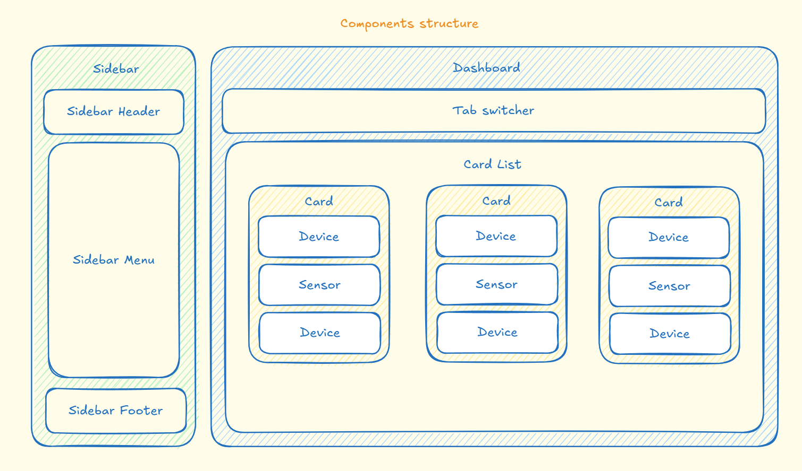

# SmartHomeUI

## Development server

To start a local development server, run:

```bash
ng start
```

Once the server is running, open your browser and navigate to `http://localhost:4200/`. The application will automatically reload whenever you modify any of the source files.

## Building

To build the project run:

```bash
ng build
```

This will compile your project and store the build artifacts in the `dist/` directory. By default, the production build optimizes your application for performance and speed.

## Components structure



More detailed component design can be found here: https://excalidraw.com/#room=2c663228ce3b1627ba6b,urhatg2cX5HlqnYxi3GeZQ
